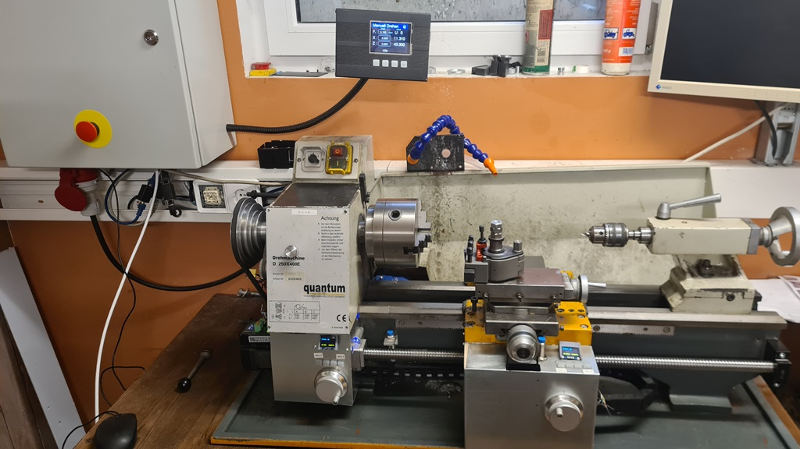

# GRBL_MPG_DRO_with_Teensy_and_MPG_Wheels

Control of the grpHall with a small touch display (ILI9341 320x240) and mpg-wheels connected via RS485.

This Project is starting from [GRBL_MPG_DRO_BoosterPack](https://github.com/terjeio/GRBL_MPG_DRO_BoosterPack).
But is use a [Teensy 3.2](https://www.pjrc.com/store/teensy32.html) for controlling. The big difference 
is that you can not only use 2 MPG wheels, but several, which can also be distributed on the machine.
The MPG wheels are connected via an rs485 busconnection.
\
\
The canvas structure from Terjeio project was unfortunately difficult for me to understand and extend (I'm not such a C pro), so I didn't use it and built my own structure. In particular, I like to use Kris Kasprzak [libraries](https://github.com/KrisKasprzak?tab=repositories), which in my opinion allow you to realize displays and buttons quite quickly and easily. But the mixture of the whole thing was not so easy, so that the whole code is again more difficult to understand :-(
\
\
The requirement is that the [grbHAL driver](https://github.com/grblHAL) is used as the CNC controller. The UART input is then used to communicate with the display and the MPGs. I use the [grbl-teensy-4](https://github.com/phil-barrett/grblHAL-teensy-4.x) board to control the motors and the connections of the inputs and outputs.  You cannot use USB and Uart at the same time with this board. USB is therefore switched off. If you want to run CNC programs, you have to connect the board to your network via Ethernet. I then use the [IoSender](https://github.com/terjeio/ioSender) as user interface.
\
The display can be used as a pure display when processing CNC code (sent via ioSender) or as a display and control unit when controlling the milling machine or lathe manually. Switching is done with a button on the display. An LED indicates the current mode.
\
\
There is still some tidying up to be done, but certain extensions are even more important at the moment for proper working.
The Source code not ready yet, there are some bugs, use it carfully!
\
\
Features:
- Control board with a SPI LCD and touch interface (ILI9341 320x240), connect via Uart with the [grbHAL driver](https://github.com/grblHAL).
- each MPG wheels has its own Pi Pico](https://www.raspberrypi.com/products/raspberry-pi-pico/) connected via rs485 with the control board.
  Own control switches and a small display is possible (SSD1306 via I2C).
- Switching from pure DRO for external CNC code and manual operation with the handwheels, and simple cycles such as turning cones or any thread.
\
\
Here I have converted my lathe, a Quantum D240x400E.
With the wheels you can also use the machine conventionally. In some cases, you can also drive certain cycles very easily. However, this has only been implemented in a rudimentary way so far.

</img>
\
\
\
## Compiling

### - Teensy for the touch display

you have to use the arduino version 1.8.19. With the latest compiler 2.x, you get compiler errors.

Following libs are used:

- https://github.com/KrisKasprzak/FlickerFreePrint
- https://github.com/KrisKasprzak/ILI9341_t3_controls
- https://github.com/KrisKasprzak/ILI9341_t3_Menu
- https://github.com/ardnew/XPT2046_Calibrated
- [Bugtton](https://github.com/sakabug/Bugtton)      Version 1.0.5
- [MicroDebug](https://github.com/rlogiacco/MicroDebug)   Version 1.1

### - Raspi pico for the mpg wheels

- download the latest micropython version from  https://micropython.org/download/RPI_PICO/.
- Hold down the BOOTSEL button while plugging the board into USB.
  The uf2 file should then be copied to the USB mass storage device that appears.
- Copy the files src\mpg_wheel\RP2040 with the Thonny IDE (https://thonny.org/) to your raspi pico.
- or you can use https://docs.micropython.org/en/latest/reference/mpremote.html 
- rename 'display_cnc_achse.py' to 'main.py' on the raspi pico

### Todo

- The rotational speed of the wheels is not yet properly evaluated. As a result, the whole thing still runs a little rough.
- Simultaneous driving of 2-axes over the wheels does not yet work in practice.
- More axis travel via the screen is not yet possible, but in work....
- The entire software is still under construction, which is why there is no release yet.
  