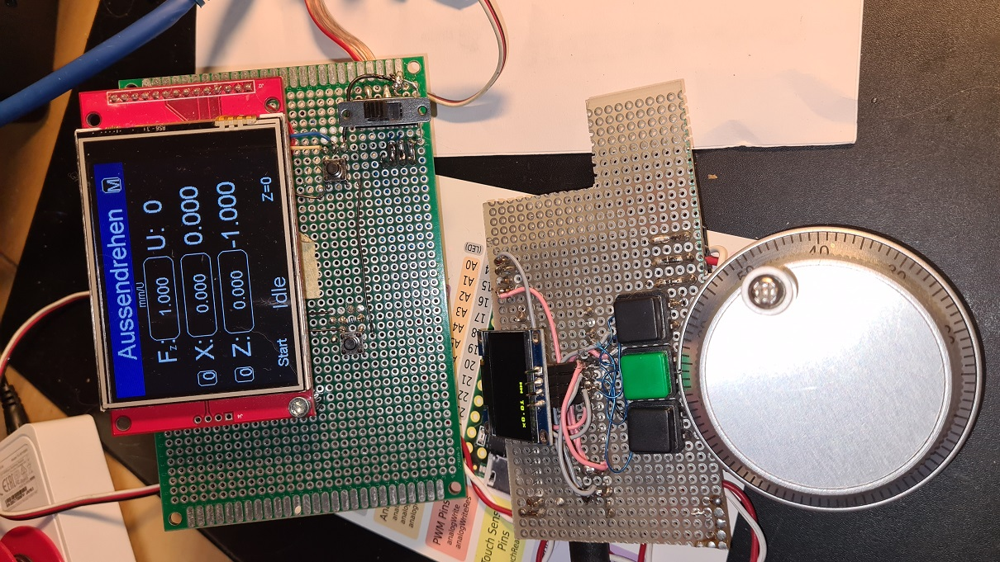

# GRBL_MPG_DRO_with_Teensy_and_MPG_Wheels
Control of the grpHall with a small touch display and mpg-wheels connected via RS485

This Project is starting from [GRBL_MPG_DRO_BoosterPack](https://github.com/terjeio/GRBL_MPG_DRO_BoosterPack).
But is use for controlling a [Teensy 3.2](https://www.pjrc.com/store/teensy32.html).
The  MPG wheels are connected via an rs485 busconnection.
 
 
Features:
- SPI LCD and touch interface
- MPG wheels connected via rs485
    
Source code not ready yet, there are some bugs, use it carfully!
   
</img>
